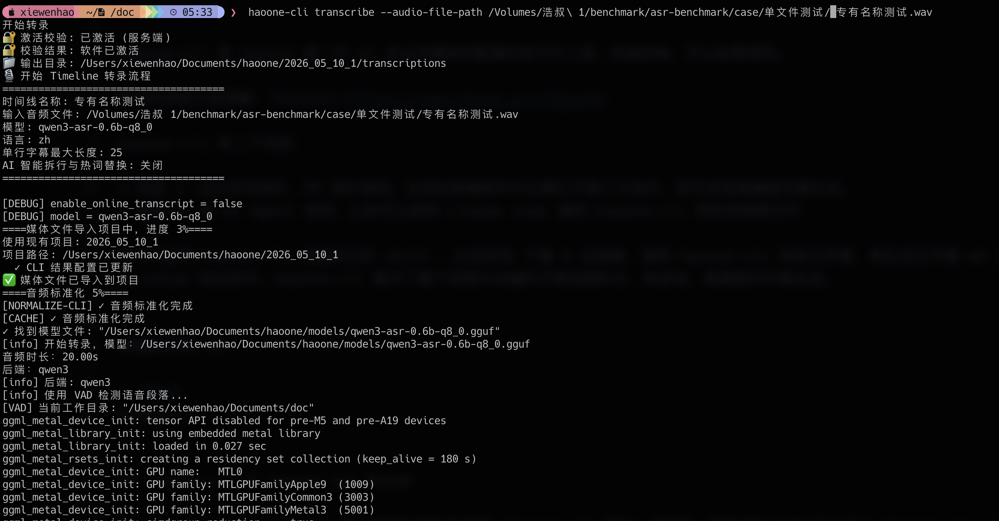
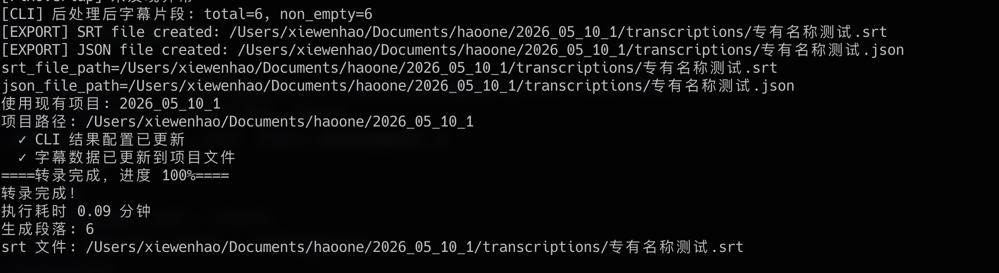
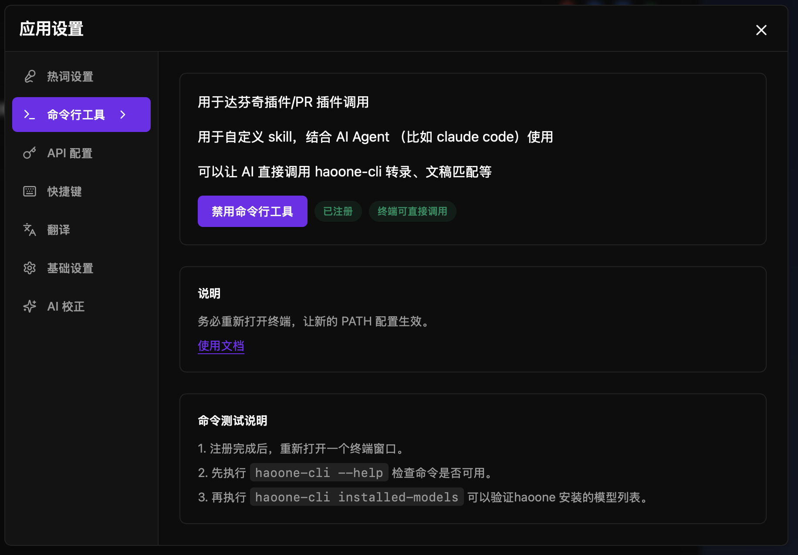
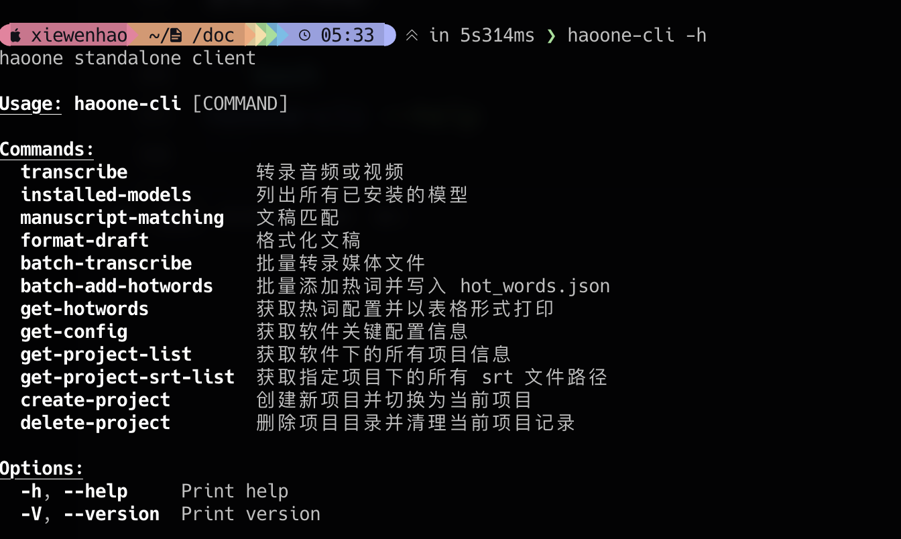

# haoone-cli

haoone-cli 是 haoone 新一代 AI 专业字幕软件配套的命令行工具，安装简单，可以免费使用。

软件的详细介绍请看：[haoone](https://www.haoai.pro/haoone)

haoone-cli 有二个用途：

* 用途 1：给达芬奇插件、PR 插件调用，实现在剪辑软件中无需打开第三方软件，即可实现高精度字幕生成。
* 用途 2：给 AI Agent 使用，比如可以使用 claude code 调用 haoone-cli 转录音视频文件

你可以使用 haoone-cli 搭建自己的 skill ，比如实现 下载 B 站视频，调用 haoone-cli 转录出字幕，再生成文字稿 md 文件，放入 obsidian 知识库中。haoone-cli 解决了整个流程中关键的不限视频时长，转录快，高精度的字幕生成。

haoone-cli 可能是市面上最快的 qwen3-asr 转录程序，针对长音视频专门优化，默认开启 GPU 加速。


终端命令统一为：

```text
haoone-cli
```




## haoone-cli 与 haoone app 的关系

haoone-cli 与 haoone app 可以完美互相配合使用，haoone-cli 用于一键转录，转录后的文件会自动进入 haoone app ，打开软件后，可以实现高效的字幕二次编辑。

模型的安装与 haoone-cli 的安装都可以在 haoone app 一键完成。实现一键懒人化安装。

### haoone 软件特点：

覆盖剪辑字幕与字幕翻译工作流的所有核心需求

本地转录、远程转录、文稿匹配、智能拆行、AI校正、AI 智能热词、翻译、双语字幕、专业字幕编辑器、字幕合成、自定义大模型 API...

让工具适配你的工作流：达芬奇字幕插件、PR字幕插件、命令行工具、skill 封装

多文件一键批量化操作

长音视频优化：2 小时的文件都能转录（mac 耗时仅需 10 分钟）

快：本地转录3分钟视频，mac mini m4 16G 20 秒内完成

准：中英转录识别准确率96%以上，带智能热词，越用越准

齐：自研词语级对齐算法，词语音频对齐率98%

软件的使用文档请看：[haoone](https://guide.haoai.pro/guide)


## 安装工具

1 到 [haoone](https://www.haoai.pro/haoone) ，注册账号，并下载 haoone 软件
2 打开软件，并完成登录
3 下载本地模型模型


4 打开应用设置，启用命令行工具



5 重新打开新的命令行终端，输入：

```text
haoone-cli -h
```

你将看到工具支持所有的命令




## 命令概览

当前支持的主要命令：

- `transcribe` - 转录音频或视频
- `installed-models` - 列出所有已安装的模型
- `manuscript-matching` - 文稿匹配
- `format-draft` - 格式化文稿
- `batch-transcribe` - 批量转录媒体文件
- `batch-add-hotwords` - 批量添加热词并写入 hot_words.json
- `get-hotwords` - 获取热词配置并以表格形式打印
- `get-config` - 获取软件关键配置信息
- `get-project-list` - 获取软件下的所有项目信息
- `get-project-srt-list` - 获取指定项目下的所有 srt 文件路径
- `create-project` - 创建新项目并切换为当前项目
- `delete-project` - 删除项目目录并清理当前项目记录


查看某个命令的帮助：

```bash
haoone-cli transcribe --help
```

## 最常用场景

## 1. 查看本机已安装模型

```bash
haoone-cli installed-models
```

适合先确认本地模型是否已经准备好。

参数表：

| 参数 | 必填 | 说明 |
| --- | --- | --- |
| 无 | 否 | 直接扫描并输出已安装模型列表 |

## 2. 转录单个音频或视频

```bash
haoone-cli \
  transcribe \
  --timeline-name demo \
  --audio-file-path /path/to/audio.mp3
```

参数表：

| 参数 | 必填 | 默认值 | 说明 |
| --- | --- | --- | --- |
| `--timeline-name` / `-n` | 否 | 自动从文件名提取 | 时间线名称 |
| `--audio-file-path` / `-f` | 是 | 无 | 输入音频或视频路径 |
| `--output` / `-o` | 否 | 自动推断 | 输出目录 |
| `--model` / `-m` | 否 | `中英-v2-2026` | 转录模型名 |
| `--language` / `-l` | 否 | `zh` | 语言代码 |
| `--enable-ai-correction` / `-a` | 否 | `false` | 是否启用 AI 智能拆行与热词替换 |
| `--max-subtitle-length` / `-s` | 否 | `25` | 单行字幕最大长度 |

示例，本地转录：

```bash
haoone-cli \
  transcribe \
  -n interview01 \
  -f /Users/you/Desktop/interview01.mp3 \
  -m 中英-v2-2026 \
  -l zh
```

示例，启用 AI 智能拆行热词替换：

```bash
haoone-cli \
  transcribe \
  -n interview01 \
  -m 中英-v2-2026 \
  -f /Users/you/Desktop/interview01.mp4 \
  -a true \
  -l zh \
  -s 22
```

输出结果：

- `*.srt`
- `*.json`

如果没有显式指定 `--output`，默认优先写入当前项目的 `transcriptions` 目录；如果当前没有项目，则会写到输入文件同级的 `transcriptions` 目录。

脚本集成时，可以关注这些标准输出：

```text
media_path=...
segmentLength=...
srt_file_path=...
json_file_path=...
```

## 3. 批量转录多个媒体文件

```bash
haoone-cli \
  batch-transcribe \
  -f /path/to/a.mp3,/path/to/b.mp4 \
  -o /path/to/out \
  -l zh
```

参数表：

| 参数 | 必填 | 默认值 | 说明 |
| --- | --- | --- | --- |
| `--audio-file-path` / `-f` | 是 | 无 | 输入媒体文件，逗号分隔或重复传入 |
| `--output` / `-o` | 否 | 自动推断 | 输出目录 |
| `--model` / `-m` | 否 | `中英-v2-2026` | 转录模型名 |
| `--language` / `-l` | 否 | `zh` | 语言代码 |
| `--enable-online-transcript` / `-w` | 否 | `false` | 是否启用在线转录 |
| `--enable-ai-correction` / `-a` | 否 | `true` | 是否启用  AI 智能拆行与热词替换 |
| `--max-subtitle-length` / `-s` | 否 | `25` | 单行字幕最大长度 |

## 4. 文稿格式化

```bash
haoone-cli \
  format-draft \
  -p /path/to/manuscript.txt
```

参数表：

| 参数 | 必填 | 说明 |
| --- | --- | --- |
| `--path` / `-p` | 是 | 输入文稿文件路径 |

这个命令会把格式化结果直接打印到终端。如果你要保存文件，可以重定向：

```bash
haoone-cli \
  format-draft \
  -p /path/to/manuscript.txt > /path/to/manuscript.formatted.txt
```

## 5. 文稿匹配

```bash
haoone-cli \
  manuscript-matching \
  --manuscript-path /path/to/manuscript.txt \
  -n transcript_name \
  -p project_name
```

参数表：

| 参数 | 必填 | 默认值 | 说明 |
| --- | --- | --- | --- |
| `--manuscript-path` | 是 | 无 | 文稿文件路径 |
| `--name` / `-n` | 是 | 无 | 转录名称（用于定位转录结果 JSON） |
| `--project` / `-p` | 否 | 当前项目 | 项目名称 |
| `--enable-splite-follows-script` / `-f` | 否 | `false` | 是否按文稿拆行 |

> 注意：文稿匹配仅限激活用户使用

成功后会输出生成的字幕文件路径。

## 6. 获取软件配置信息

```bash
haoone-cli get-config
```

此命令会以表格形式输出当前软件的关键配置信息，包括：

- 应用数据目录路径
- app.json 文件路径
- 激活状态
- 最近打开的项目
- 当前项目
- 项目目录
- 项目数量
- 自定义 API 配置（endpoint、model、apiKey 等）
- 用户 token 状态

参数表：

| 参数 | 必填 | 说明 |
| --- | --- | --- |
| 无 | 否 | 直接读取并输出配置信息 |

## 7. 获取项目列表

```bash
haoone-cli get-project-list
```

此命令会以表格形式列出所有项目信息，包括：

- 项目名
- 项目路径
- 更新时间
- 最近打开时间
- 是否为当前项目

参数表：

| 参数 | 必填 | 说明 |
| --- | --- | --- |
| 无 | 否 | 直接读取并输出项目列表 |

## 8. 获取项目下的 SRT 文件列表

```bash
haoone-cli \
  get-project-srt-list \
  -p project_name
```

此命令会递归查找指定项目目录下的所有 `.srt` 文件并输出路径。

参数表：

| 参数 | 必填 | 默认值 | 说明 |
| --- | --- | --- | --- |
| `--project-name` / `-p` | 否 | 当前项目 | 项目名称 |

## 9. 创建项目

```bash
haoone-cli \
  create-project \
  -n demo-project
```

参数表：

| 参数 | 必填 | 说明 |
| --- | --- | --- |
| `--name` / `-n` | 是 | 项目名称 |

## 10. 删除项目

```bash
haoone-cli \
  delete-project \
  -n demo-project
```

如果不传 `--name`，程序会尝试删除当前项目。

参数表：

| 参数 | 必填 | 说明 |
| --- | --- | --- |
| `--name` / `-n` | 否 | 项目名称，不传时尝试删除当前项目 |

## 11. 批量添加热词

直接传字符串：

```bash
haoone-cli \
  batch-add-hotwords \
  -l zh \
  --input "OpenAI=欧喷AI,Open A I"
```

从文件读取：

```bash
haoone-cli \
  batch-add-hotwords \
  -l zh \
  -f /path/to/hotwords.txt
```

参数表：

| 参数 | 必填 | 默认值 | 说明 |
| --- | --- | --- | --- |
| `--language` / `-l` | 是 | 无 | 热词语言 |
| `--file` / `-f` | 否 | 无 | 从文件读取热词内容 |
| `--input` | 否 | 无 | 直接传入热词文本 |

说明：

- `--file` 和 `--input` 至少传一个
- 两者同时传时，优先读取 `--file`

支持两种输入格式。

格式一：

```text
OpenAI=欧喷AI,Open A I
ChatGPT=chat g p t,Chat GP T
```

格式二：

```text
OpenAI
欧喷AI
Open A I

ChatGPT
chat g p t
Chat GP T
```

## 12. 获取热词配置

```bash
haoone-cli get-hotwords
```

此命令会以表格形式输出当前热词配置，包括：

- 语言
- 热词
- 别名
- 拼音
- 首字母

参数表：

| 参数 | 必填 | 说明 |
| --- | --- | --- |
| 无 | 否 | 直接读取并输出热词配置 |

## 故障排除 Troubleshooting

如果你在运行 `haoone-cli` 时遇到问题，可以按下面顺序检查。

## 1. 先确认基础条件

- 安装haoone 桌面端，并完成用户登录
- 请确认 `haoone-cli` 已正确安装，并且当前终端里可以直接执行 `haoone-cli --help`
- 请确认你使用的是最新版本的 haoone 桌面端和对应 CLI
- 如果你刚刚安装或更新了 CLI，请先关闭并重新打开终端，让 PATH 变更生效
- 如果命令依赖登录、项目或 AI 能力，请先启动 haoone 桌面端，并确认已经登录、激活、打开过项目

## 2. 如果终端提示 `haoone-cli: command not found`

先直接检查命令是否可用：

```bash
haoone-cli --help
which haoone-cli
```

如果 `which haoone-cli` 没有输出，通常说明：

- `haoone-cli` 不在 PATH 中
- 你当前终端还没有重新启动
- CLI 文件没有执行权限

你可以先用绝对路径运行：

```bash
/Users/XXX/Documents/dev/app/haoone/src-tauri/binaries/haoone-cli-aarch64-apple-darwin --help
```

如果绝对路径可以运行，但 `haoone-cli` 不行，说明问题基本就是 PATH。

## 3. 重新打开终端

如果你刚刚完成安装、复制文件、创建符号链接或修改 PATH，请重启终端后再试：

```bash
haoone-cli --help
```

很多“明明已经装了但命令找不到”的问题，都是因为当前终端会话还没加载新的 PATH。

## 4. 检查桌面端状态

部分命令依赖 haoone 桌面端本地状态，而不是完全独立运行。出现下面这些问题时，优先检查桌面端：

- 提示未登录
- 提示未激活
- 在线转录失败
- 翻译 / 双语字幕 / AI 校正失败
- 找不到当前项目

建议检查：

1. haoone 桌面端已经启动过
2. 当前账号已登录
3. 软件已激活
4. 当前项目可以在桌面端正常打开

## 6. Windows

如果 Windows 下提示“不是内部或外部命令”，通常是 PATH 没生效，或者没有把 `haoone-cli.exe` 所在目录加入 PATH。

建议按这个顺序排查：

1. 确认 `haoone-cli.exe` 实际存在
2. 确认它所在目录已经加入用户 PATH
3. 完全关闭当前终端，再重新打开
4. 再执行 `haoone-cli --help`

如果你不确定 PATH 是否生效，可以先进入二进制所在目录后再执行。

## 7. 转录或 AI 功能失败

这类问题常见原因有：

- 没登录
- 没激活
- 当前项目缺失
- 网络不可用
- 本地模型未安装
- 在线转录的音频超过 45 分钟

建议先执行：

```bash
haoone-cli installed-models
```

确认模型可见，然后再检查桌面端登录和网络状态。

## 8. 输出文件找不到

如果命令执行完成了，但你没找到生成文件，优先检查：

1. 你显式传入的 `--output` 目录
2. 当前项目目录下的 `transcriptions`
3. 输入文件同级目录下的 `transcriptions`

转录命令还会在 stdout 打印：

```text
srt_file_path=...
json_file_path=...
```

可以直接按这两行确认真实输出路径。